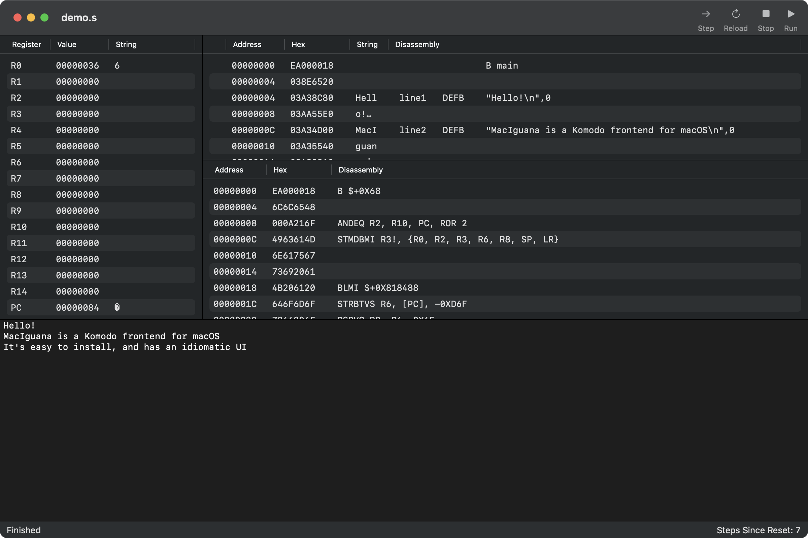

#  MacIguana

MacIguana is an ARM debugger for macOS, intended as a modern replacement for [Komodo](https://studentnet.cs.manchester.ac.uk/resources/software/komodo/). It uses the same underlying emulator as Komodo.
